# Registries for Rancher — user guide

Create and manage private container registries on Harvester from the Rancher UI.

| | |
| --- | --- |
| **Extension** | Registries 0.1.0 (Rancher UI extension) |
| **Works with** | Rancher 2.15 or later, and a Harvester cluster running the registry operator 0.1.0 or later |
| **For** | Developers and teams who need a private registry, and the administrators who install the extension |

## Contents

1. [What it is](#1-what-it-is)
2. [Features](#2-features)
3. [Before you start](#3-before-you-start)
4. [Install the extension (administrators)](#4-install-the-extension-administrators)
5. [Find your registries](#5-find-your-registries)
6. [Overview](#6-overview)
7. [See all registries](#7-see-all-registries)
8. [Create a registry](#8-create-a-registry)
9. [Registry details](#9-registry-details)
10. [Push and pull images](#10-push-and-pull-images)
11. [Change the plan](#11-change-the-plan)
12. [More actions](#12-more-actions)
13. [Delete a registry](#13-delete-a-registry)
14. [Who can do what](#14-who-can-do-what)
15. [Troubleshooting](#15-troubleshooting)
16. [Good to know](#16-good-to-know)

## 1. What it is

**Registries** adds a page to Rancher where you can get your own private container registry in a few
clicks. You pick a namespace, a name and a size. Within seconds the registry is ready, with a storage
quota and two credentials: one to pull images and one to push them.

Behind the page, the [registry operator](../../registry/README.md) on Harvester does the work in
Harbor. You never need to log in to Harbor yourself.

| Each registry gives you | Details |
| --- | --- |
| A private Harbor project | Named after your registry plus 8 random characters, e.g. `web-0d9ad935`. Only your credentials can reach it. |
| A storage quota | Set by the plan you choose: 5, 20 or 100 GiB. |
| A pull credential | Secret `<name>-pull`. Pull only. Use it where your apps run. |
| A push credential | Secret `<name>-push`. Pull, push and delete images. Use it in build pipelines. |

## 2. Features

- **Registries** in Rancher's left menu, listing every Harvester cluster that can give you a registry.
- **Overview** of a cluster: how many registries exist, which need attention, quota per plan, and
  whether the operator and Harbor are healthy.
- **Create** a registry with a simple form: namespace, name, plan.
- **Details** of each registry: its Harbor project, address, quota and credential names.
- **Connect** tab with ready-to-copy commands to log in, push an image, and use the registry from
  another cluster.
- **Change the plan** at any time to grow or shrink the quota.
- **Delete** a registry, with a confirmation step.
- Works with Rancher's own permissions: you see and manage registries only in namespaces you have
  access to.

## 3. Before you start

| You need | Who provides it |
| --- | --- |
| Rancher 2.15 or later | Your Rancher administrator |
| A Harvester cluster with the registry operator installed ([registry operator](../../registry/)) | Your Harvester administrator |
| The **Registries** extension installed in Rancher ([section 4](#4-install-the-extension-administrators)) | Your Rancher administrator, once |
| The **edit** role (or higher) in a namespace on that cluster | Your Rancher administrator |
| Docker, Podman or another container tool, to push images | You |

## 4. Install the extension (administrators)

Do this once per Rancher. The extension is published as an Extension Catalog Image,
`ghcr.io/wso2/ui-extension-registry-ui:<version>`; the release notes give the current version.

1. In Rancher, open ☰ → **Extensions**.
2. Click ⋮ (top right) → **Manage Extension Catalogs** → **Import Extension Catalog**.
3. Enter the catalog image and click **Load**. Wait until the catalog shows **Active**.
4. Go back to **Extensions** → **Available**, find **Registries**, click **Install**.
5. When Rancher asks, click **Reload**. **Registries** now appears in the left menu.

> [!NOTE]
> To update later, import the new version's catalog image, then **Extensions** → **Installed** →
> **Registries** → **Update**. To remove it: **Uninstall**. Removing the extension only removes the
> pages; every registry, image and credential stays as it is.

Where Rancher cannot reach `ghcr.io`, copy the image into a registry it can reach and import it from
there; the import dialog accepts a pull secret for a private registry.

## 5. Find your registries

Open Rancher's left menu (☰) and click **Registries**.

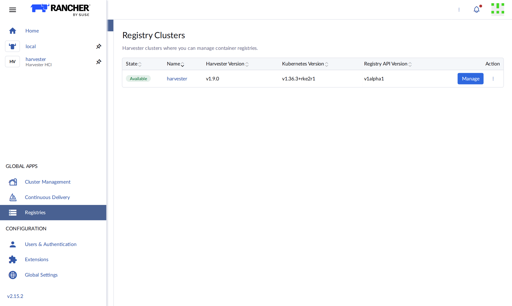

The **Registry Clusters** page lists the Harvester clusters where you can create registries. Click
**Manage** on the cluster you want.

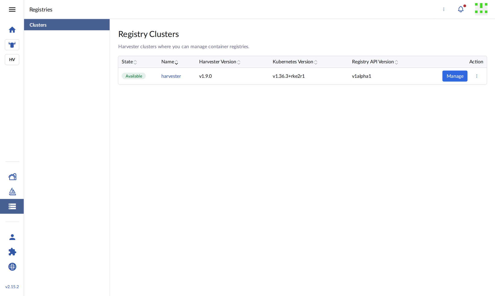

| State | Meaning |
| --- | --- |
| Available | The registry operator is installed and you can use this cluster. |
| Unavailable | Rancher cannot reach this cluster right now. Try again later. |
| Error | Rancher could not check the cluster. The message says why; click **Retry**. |

The ⋮ menu next to **Manage** gives quick cluster tools: a browser **Kubectl Shell** and your
**KubeConfig** file. You need one of these to read credentials ([section 10](#10-push-and-pull-images)).

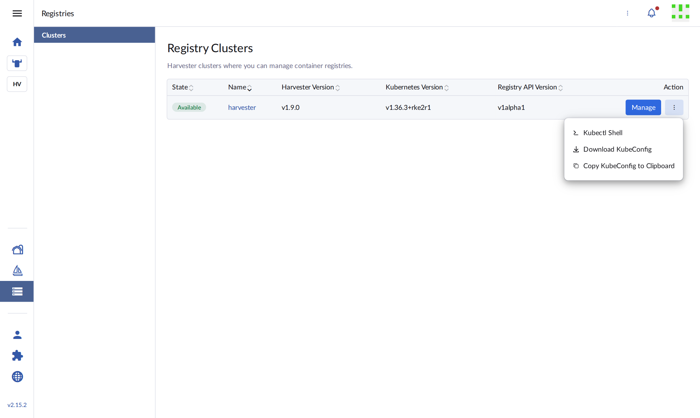

## 6. Overview

**Manage** opens the cluster's **Overview**. Everything here is read-only.

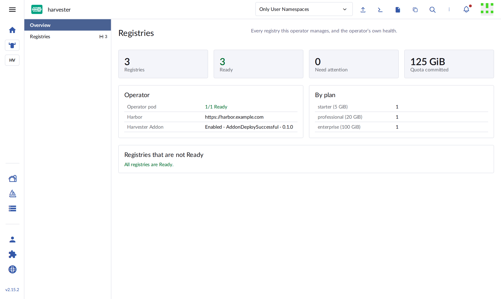

| Part | What it shows |
| --- | --- |
| Top tiles | Number of registries, how many are Ready, how many need attention, and total quota given out. |
| Operator | Whether the operator is running, the Harbor address it uses, and the state of its Harvester Addon. |
| By plan | How many registries use each plan. |
| Registries that are not Ready | Any registry with a problem, and its message. Empty when all is well. |

Use the namespace selector at the top (**Only User Namespaces**) to show one namespace or all of them,
on every page.

## 7. See all registries

Click **Registries** in the side menu. Registries are grouped by namespace.

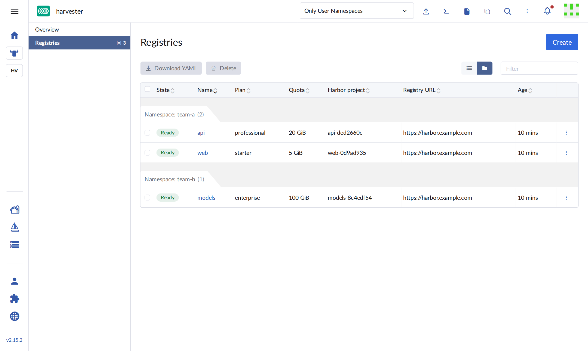

| Column | Meaning |
| --- | --- |
| State | **Ready**: ready to use. **Provisioning**: being set up. **Failed**: something went wrong; open it to see why. **Terminating**: being deleted. |
| Name | Your registry's name. Click it to open the details. |
| Plan / Quota | The chosen plan and the storage quota it gives. |
| Harbor project | The project in Harbor. This is part of every image name. |
| Registry URL | The registry address. Log in and push to this host. |

Use **Filter** to search, and the two buttons next to it to switch between a flat list and the
namespace groups.

## 8. Create a registry

1. On the **Registries** page, click **Create**.
2. Choose the **Namespace**. The registry and its credentials are created there.
3. Type a **Name**: lowercase letters, numbers and dashes, e.g. `frontend`.
4. Pick a **Plan**.

   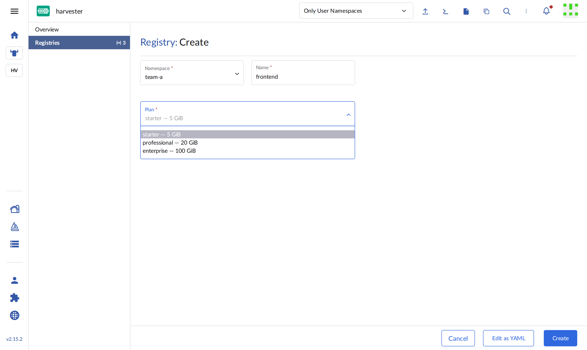

   | Plan | Storage quota | Good for |
   | --- | --- | --- |
   | starter (default) | 5 GiB | A few small images, trials |
   | professional | 20 GiB | A team's day-to-day images |
   | enterprise | 100 GiB | Many or large images, e.g. ML models |

5. Click **Create**.

   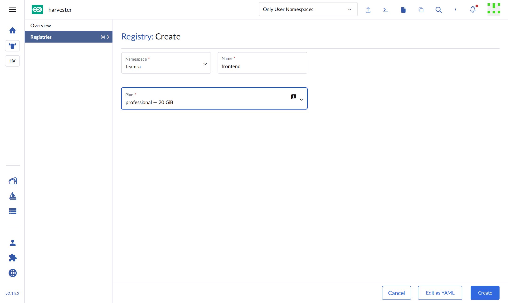

The registry shows **Provisioning** and turns **Ready** within a few seconds. You can change the plan
later; the name and namespace cannot change.

## 9. Registry details

Click a registry's name to open it.

### Summary

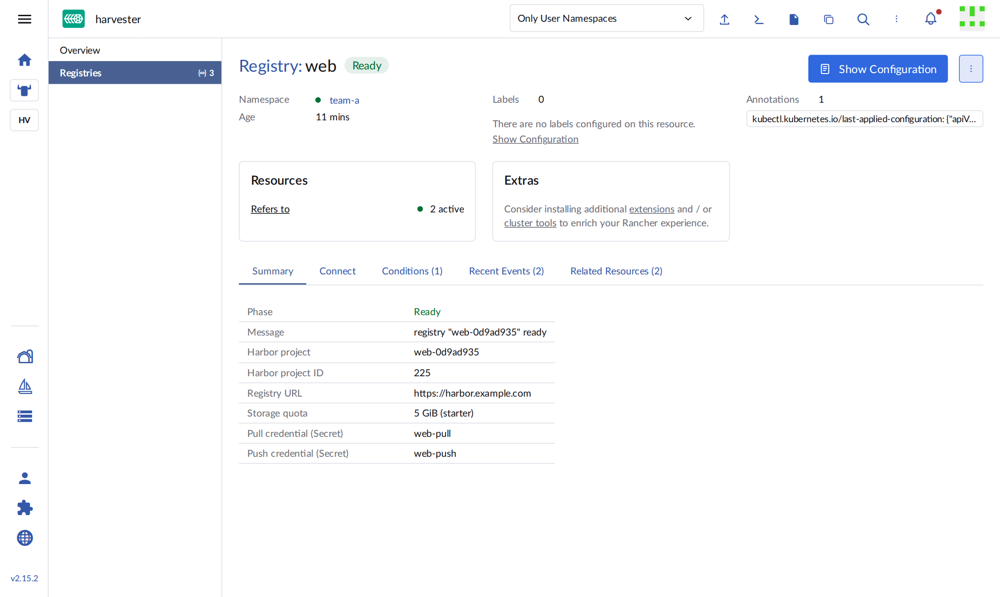

| Field | Meaning |
| --- | --- |
| Phase / Message | The current state, and a short explanation. |
| Harbor project | Use it in image names: `<registry host>/<Harbor project>/<image>:<tag>`. |
| Registry URL | Where to log in and push. |
| Storage quota | The limit for all images in this registry together. |
| Pull / Push credential | The names of the two Secrets in the same namespace. |

### Connect

Ready-to-copy commands, already filled in with this registry's names.
[Section 10](#10-push-and-pull-images) explains them step by step.

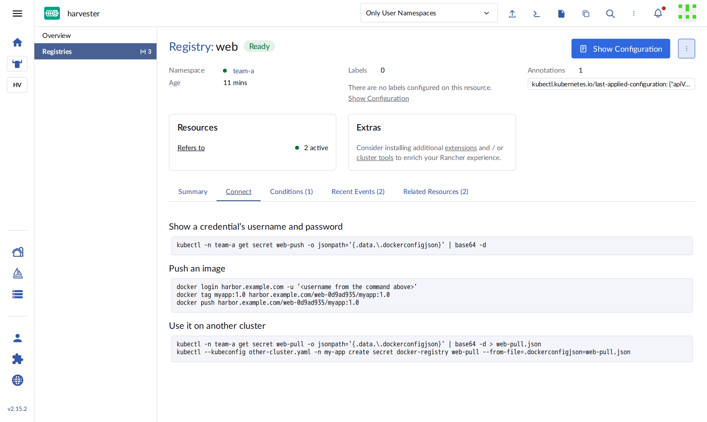

### Conditions, Recent Events, Related Resources

**Conditions** shows whether the registry is Ready and why. **Recent Events** lists what happened to
it, which helps when something fails. **Related Resources** links to its two credential Secrets.

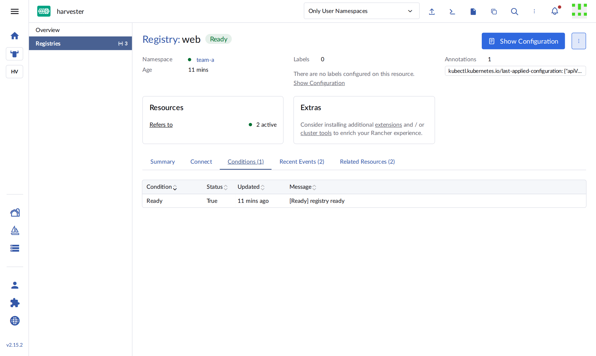

## 10. Push and pull images

Run these commands on your machine (with the KubeConfig from [section 5](#5-find-your-registries)) or
in Rancher's **Kubectl Shell**. The examples use the registry `web` in namespace `team-a`; the
**Connect** tab gives you the exact commands for yours.

### Get the credentials

```sh
kubectl -n team-a get secret web-push -o jsonpath='{.data.\.dockerconfigjson}' | base64 -d
```

The output contains a `username` (it starts with `robot$`) and a `password`. Use `web-pull` instead of
`web-push` for the pull-only credential.

### Push an image

```sh
docker login harbor.example.com -u 'robot$...'      # paste the password when asked
docker tag myapp:1.0 harbor.example.com/web-0d9ad935/myapp:1.0
docker push harbor.example.com/web-0d9ad935/myapp:1.0
```

> [!TIP]
> Keep the single quotes around the username: the `$` in it must not be read by your shell.

### Run the image on another cluster

Copy the pull credential to the namespace where your app runs:

```sh
kubectl -n team-a get secret web-pull -o jsonpath='{.data.\.dockerconfigjson}' | base64 -d > web-pull.json
kubectl --kubeconfig other-cluster.yaml -n my-app create secret docker-registry web-pull \
  --from-file=.dockerconfigjson=web-pull.json
rm web-pull.json
```

Then reference it in your workload:

```yaml
spec:
  imagePullSecrets:
    - name: web-pull
  containers:
    - name: myapp
      image: harbor.example.com/web-0d9ad935/myapp:1.0
```

## 11. Change the plan

1. Open the registry, click ⋮ (top right) → **Edit Config**.
2. Pick a new **Plan** and click **Save**.

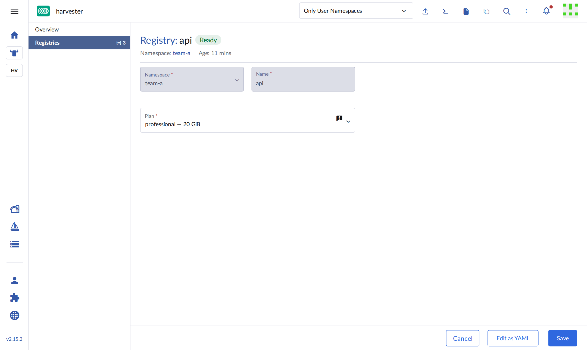

The new quota applies in Harbor within seconds. Your images and credentials stay the same.

## 12. More actions

The ⋮ menu at the end of each row (or at the top right of a registry) offers:

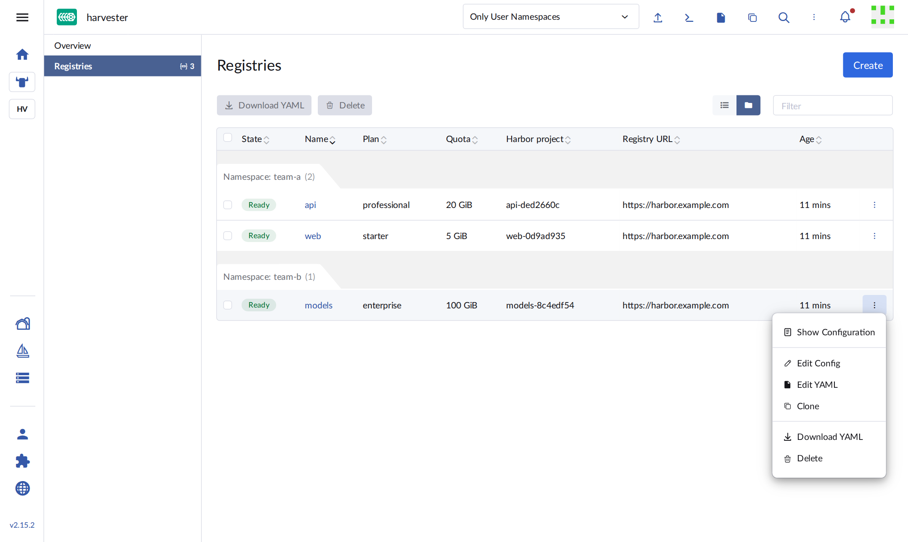

| Action | What it does |
| --- | --- |
| Show Configuration | Shows the registry's settings in a side panel. |
| Edit Config | Opens the form to change the plan. |
| Edit YAML | Edit the registry as YAML. For advanced users. |
| Clone | Starts a new registry with the same plan. |
| Download YAML | Saves the registry definition as a file, e.g. to keep it in Git. |
| Delete | Deletes the registry ([section 13](#13-delete-a-registry)). |

## 13. Delete a registry

1. Click ⋮ on the registry → **Delete**. To delete several, tick them and click **Delete** above the
   list.
2. Check the name and click **Delete**.

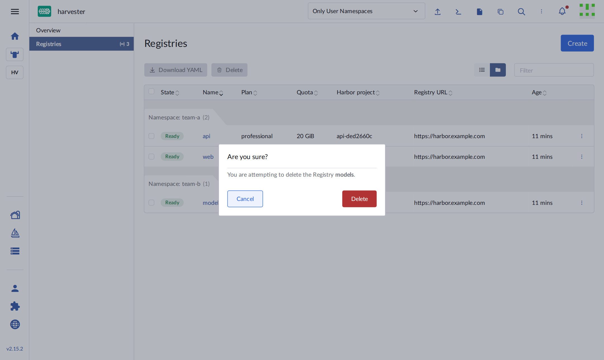

> [!WARNING]
> **This cannot be undone.** Deleting a registry deletes its Harbor project, **all its images**, and
> both credentials. Apps still pulling from it will fail to start. Copy any images you need first.

## 14. Who can do what

Access follows the Rancher roles you have in each namespace.

| Role in the namespace | See registries | Create, edit, delete | Read credentials |
| --- | --- | --- | --- |
| view (read-only) | Yes | No | No |
| edit | Yes | Yes | Yes |
| admin / owner | Yes | Yes | Yes |

The extension itself never reads credentials. It shows only their names; reading them always uses your
own permissions.

## 15. Troubleshooting

| What you see | What to do |
| --- | --- |
| No **Registries** in the left menu | The extension is not installed, or the page needs a reload. Ask your Rancher administrator. |
| "No clusters with the registry operator are available to you." | The operator is not installed on any cluster you can access, or you have no role there. Ask your administrator. |
| The **Create** button is missing | You have only the view role in that namespace. Ask for the edit role. |
| A registry stays **Provisioning**, or shows **Failed** | Open it and read **Message**, **Conditions** and **Recent Events**. Check the **Overview**: the operator pod should be Ready. If Harbor is down, the registry becomes Ready on its own once Harbor is back. |
| `docker login` fails with `x509: certificate signed by unknown authority` | Your machine does not trust Harbor's certificate. Install your organisation's CA certificate, then restart Docker. |
| `docker login` fails with `unauthorized` | Copy the username and password again; quote the username with single quotes. |
| `docker push` is denied | Use the **push** credential, not the pull one, and check the image name includes the Harbor project. |
| `docker push` fails with a quota message | The registry is full. Delete old images, or move to a bigger plan ([section 11](#11-change-the-plan)). |
| Pods show `ImagePullBackOff` | The pull credential is missing in the pod's namespace, or not listed under `imagePullSecrets` ([section 10](#10-push-and-pull-images)). |

## 16. Good to know

- **A credential leaked?** Delete its Secret (e.g. `kubectl -n team-a delete secret web-push`). The old
  credential stops working at once and a new Secret appears within seconds. Update the places that used
  the old one.
- **Credentials do not expire.** They work until you delete them or the registry.
- **Names are unique per namespace.** Two teams can both have a registry called `web`; each gets its
  own Harbor project.
- **Everything in the UI can also be done with `kubectl`.** The UI and `kubectl` always show the same
  registries.
